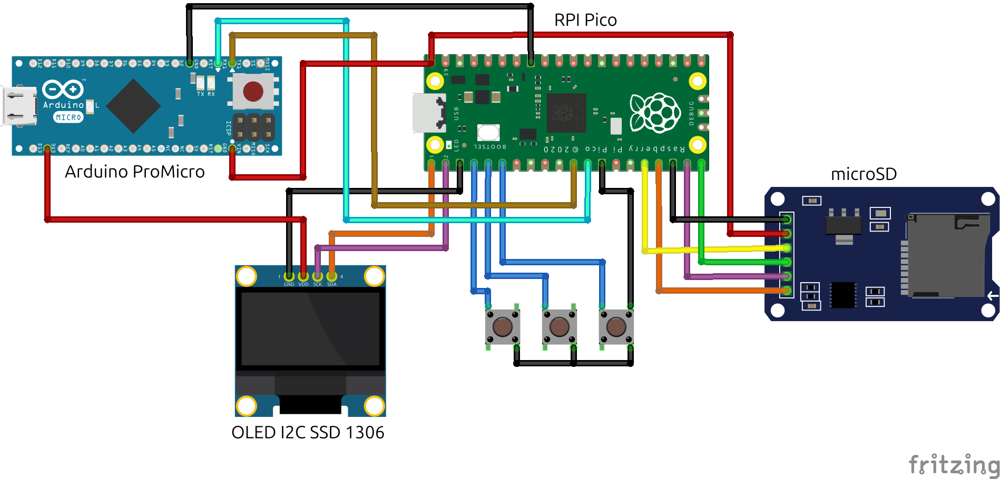
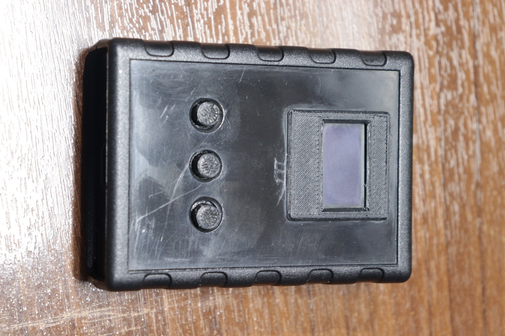
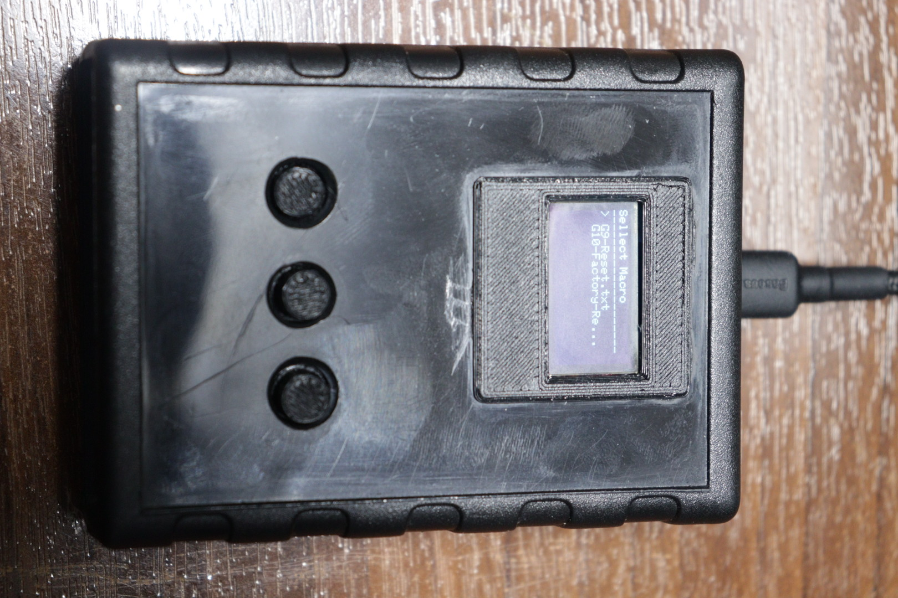

# P.A.S.S (Pico Arduino Server Setup)

This project implements a powerful and flexible BadUSB tool using a dual-microcontroller architecture: a **Raspberry Pi Pico** and an **Arduino ProMicro**. It was originally designed to automate the factory reset process on a large number of HPE Gen8 and Gen9 servers, saving countless hours of manual configuration.

## 🌟 Why Two Microcontrollers?

The HPE Gen8/Gen9 BIOS only recognizes specific USB devices as keyboards during the boot process. While the Raspberry Pi Pico is powerful enough to handle SD card reading, an OLED display, and a user interface, its USB HID implementation wasn't recognized by these specific servers. 

To solve this, we used an **Arduino ProMicro** (which uses the ATmega32U4 and is natively recognized by almost any BIOS as a standard keyboard) as the "executor", and the **Raspberry Pi Pico** as the "brain".

### 🧠 Raspberry Pi Pico (The Brain)
- Reads DuckyScript payloads from a MicroSD card.
- Drives an OLED display (128x64) for the user interface.
- Handles user input via 3 push buttons (Up, Down, Select).
- Utilizes both cores (Core 0 for UI, Core 1 for file processing and serial communication).
- Sends parsed commands to the ProMicro via UART Serial.

### ⌨️ Arduino ProMicro (The Executor)
- Receives commands from the Pico via UART Serial.
- Acts as a standard USB HID Keyboard using the [HID-Project by NicoHood](https://github.com/nicohood/hid) library.
- Executes the keystrokes on the target machine (recognized even in restrictive BIOS environments).

---

## 🛠️ Hardware Requirements

- 1x Raspberry Pi Pico
- 1x Arduino ProMicro (or any ATmega32U4 board like Pro Micro)
- 1x MicroSD Card Module (SPI)
- 1x 0.96" OLED Display (I2C - SSD1306)
- 3x Push Buttons
- Jumper wires and a breadboard/PCB

## 🔌 Wiring Guide

### Raspberry Pi Pico to Peripherals

| Component | Pin | Pico Pin |
|-----------|-----|----------|
| **OLED**  | SDA | GP4 (I2C0 SDA) |
| **OLED**  | SCL | GP5 (I2C0 SCL) |
| **SD Card**| CS  | GP17 |
| **SD Card**| SCK | GP18 (SPI0 SCK) |
| **SD Card**| MOSI| GP19 (SPI0 TX) |
| **SD Card**| MISO| GP16 (SPI0 RX) |
| **Buttons**| UP  | GP2 |
| **Buttons**| DOWN| GP3 |
| **Buttons**| SEL | GP6 |

*(All buttons should be connected between the GPIO pin and GND, as `INPUT_PULLUP` is used in the code).*

### Pico to ProMicro Communication (UART)

| Pico Pin | ProMicro Pin |
|----------|--------------|
| TX (GP0) | RX (Pin 0)   |
| RX (GP1) | TX (Pin 1)   |
| GND      | GND          |

---

## 🚀 Installation & Setup

1. **Prepare the MicroSD Card:**
   - Format your MicroSD card to FAT32.
   - Place your DuckyScript `.txt` files in the root directory.

2. **Flash the Arduino ProMicro:**
   - Open `P.A.S.S(Arduino).ino` in the Arduino IDE.
   - Install the `HID-Project` library (Tools > Manage Libraries... search for "HID-Project").
   - Select "Arduino ProMicro" as the board.
   - Upload the code.

3. **Flash the Raspberry Pi Pico:**
   - Open `P.A.S.S(RPI).ino` in the Arduino IDE.
   - Ensure you have the [Earle Philhower's Arduino-Pico core](https://github.com/earlephilhower/arduino-pico) core installed.
   - Install required libraries: `Adafruit GFX`, `Adafruit SSD1306`, `SD`.
   - Upload the code.

## 📝 Supported DuckyScript Commands (via Pico to ProMicro)

The ProMicro script supports the following commands, sent from the Pico:

- `STRING <text>`: Types the specified text.
- `KEY <key_name>`: Presses and immediately releases a single key. Examples: `KEY ENTER`, `KEY ESC`, `KEY A`, `KEY 1`.
- `COMBO <key1> <key2> ...`: Presses multiple keys simultaneously, holds them briefly, and then releases all. Useful for modifier combinations. Examples: `COMBO CTRL ALT DELETE`, `COMBO GUI R`.

**Supported `key_name` values for `KEY` and `COMBO` commands:**
`ENTER`, `ESC`, `BACKSPACE`, `TAB`, `SPACE`, `PRINTSCREEN`, `SCROLLLOCK`, `PAUSE`, `INSERT`, `HOME`, `PAGEUP`, `PAGEDOWN`, `DELETE`, `END`, `RIGHT`, `LEFT`, `DOWN`, `UP`, `NUMLOCK`, `CAPSLOCK`,`F1-F12`.

**Modifier Keys (for `KEY` and `COMBO`):**
`CTRL`, `SHIFT`, `ALT`, `GUI` (Windows Key).
Also `RCTRL`, `RSHIFT`, `RALT`, `RGUI` for right-side modifiers.

**Alphanumeric Keys:**
Single letters (`A-Z`) and numbers (`0-9`) are also supported directly as `key_name` (e.g., `KEY A`, `COMBO CTRL C`).

**Pico-handled commands (not sent to ProMicro):**
- `DELAY <time_in_ms>`: Pauses execution for the specified milliseconds.
- `INTERRUPT`: Pauses execution until the Pico's Select button is pressed again.

## ❓ Troubleshooting

- **Server doesn't recognize device:** Ensure the Arduino ProMicro is being powered and communicating via the correct Serial baud rate. Check if the target BIOS allows USB HID devices during boot.
- **OLED is blank:** Double-check the I2C wiring (SDA/SCL) and ensure the I2C address in the code matches your display (usually `0x3C`).
- **SD Card not reading:** Ensure the card is FAT32 and the CS pin matches your wiring.
- **Keyboard Layout:** Note that this tool assumes a **US Keyboard Layout**. If your target system uses a different layout, some symbols may be typed incorrectly.

## 🖼️ Gallery

## 💡 Use Case: HPE Server Automation
This tool was a lifesaver for managing legacy HPE infrastructure. By writing a script that navigates the BIOS menus (using `F9`, `DOWN`, `ENTER`, etc.), we automated the tedious process of factory resetting dozens of Gen8/Gen9 servers without needing to attach a physical keyboard and monitor to each one.

## 📄 License
This project is licensed under the GNU General Public License v3.0 (GPL-3.0).
For more information, see the LICENSE file in this repository.

